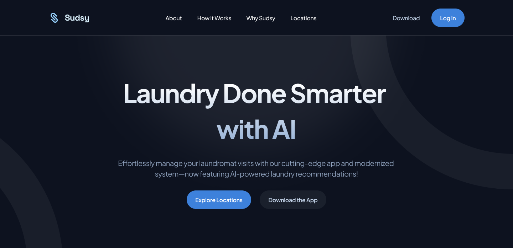
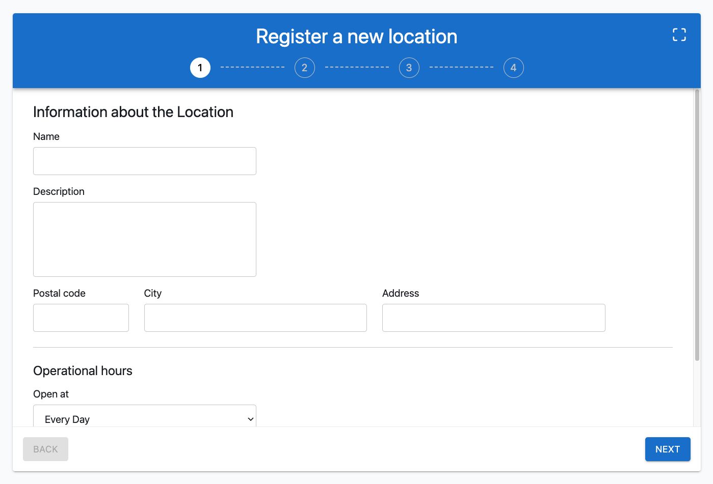
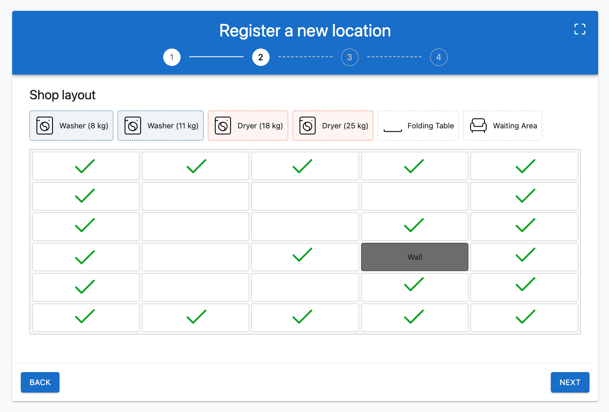

# Sudsy - A revolutionized laundromat franchise in Hungary

**WorldSkills Shanghai 2026 Hungarian National Competition, Web Technologies - Round 1**

Submitted by: [Skills IT](https://skillsit.hu)

You've been working as a **freelance web developer**, but now you're aiming to secure a developer position at a promising new startup in Hungary: **Sudsy**. To evaluate your skills, the company's management has asked you to develop a **prototype** for their innovative service as part of the hiring process.

In this round, your task is to create a visually compelling and engaging **website** that highlights Sudsy as a cutting-edge platform. The site should attract potential users by showcasing the company's **modern mobile app**, seamless system, and unique **AI-powered features**, such as fabric analysis to recommend optimal washing and drying settings.

You will leverage your **HTML and CSS** expertise to craft a website that is visually appealing, meets accessibility standards, and implements SEO best practices. Additionally, you'll demonstrate your proficiency with **JavaScript libraries** like React, Vue or Angular by creating an advanced multi-step form that includes validation, utilizes browser APIs, and showcases your technical capabilities.

**The development process is divided into two phases:**

- **Phase 1:** You will create the website using only **vanilla HTML and CSS**. All related work files should be placed in the `phase-1` folder.
- **Phase 2:** You will develop the project using a **JavaScript framework** such as React, Vue, or Angular. Organize your source files in the `phase-2-src` folder, and place the built project in the `phase-2` folder for deployment purposes ([deployment details will follow later](#33-project-structure-and-deployment)).

Every needed media, icons and text have been provided for you in the [`media`](./media) folder. You are free to use these. **You should not use any other media files** _(e.g. downloaded videos, images, icons, etc.)_.

---

- [Sudsy - A revolutionized laundromat franchise in Hungary](#sudsy---a-revolutionized-laundromat-franchise-in-hungary)
  - [1 Landing website (Phase 1)](#1-landing-website-phase-1)
    - [1.1 Design](#11-design)
      - [1.1.1 Custom font](#111-custom-font)
    - [1.2 Sections](#12-sections)
      - [1.2.1 Header, navigation](#121-header-navigation)
        - [1.2.1.1 Desktop view](#1211-desktop-view)
        - [1.2.1.2 Mobile view (hamburger)](#1212-mobile-view-hamburger)
      - [1.2.2 Hero section](#122-hero-section)
      - [1.2.3 About section](#123-about-section)
      - [1.2.4 How It Works section](#124-how-it-works-section)
      - [1.2.5 Why Us section](#125-why-us-section)
      - [1.2.6 Download section](#126-download-section)
      - [1.2.7 Highlighted Locations section](#127-highlighted-locations-section)
      - [1.2.8 Footer](#128-footer)
    - [1.3 Responsiveness](#13-responsiveness)
    - [1.4 Accessibility](#14-accessibility)
    - [1.5 SEO Best Practices](#15-seo-best-practices)
    - [1.6 Validation](#16-validation)
  - [2 Multistep form for registering a new laundromat location (Phase 2)](#2-multistep-form-for-registering-a-new-laundromat-location-phase-2)
    - [2.1 Header](#21-header)
      - [2.1.1 Fullscreen](#211-fullscreen)
      - [2.1.2 Steps](#212-steps)
    - [2.2 Footer](#22-footer)
    - [2.3 Step 1: General Information](#23-step-1-general-information)
      - [2.3.1 Fields and their validations](#231-fields-and-their-validations)
      - [2.3.2 Validation](#232-validation)
    - [2.4 Step 2: Floorplan Design](#24-step-2-floorplan-design)
      - [2.4.1 Toolbar](#241-toolbar)
      - [2.4.2 Grid](#242-grid)
      - [2.4.3 Validation](#243-validation)
    - [2.5 Step 3: Extras](#25-step-3-extras)
      - [2.5.1 Amenities (Checkboxes)](#251-amenities-checkboxes)
      - [2.5.2 Parking Difficulty (Radio Buttons)](#252-parking-difficulty-radio-buttons)
      - [2.5.3 Validation](#253-validation)
    - [2.6 Step 4: Finish Screen](#26-step-4-finish-screen)
      - [2.6.1 Copy form values](#261-copy-form-values)
      - [2.6.2 Export floorplan](#262-export-floorplan)
      - [2.6.3 Start over](#263-start-over)
    - [2.7 Data persistency](#27-data-persistency)
    - [2.8 Library, Framework, and NPM Module Limitations](#28-library-framework-and-npm-module-limitations)
  - [3 Instructions to the Competitor](#3-instructions-to-the-competitor)
    - [3.1 Clean Code](#31-clean-code)
    - [3.2 Git usage](#32-git-usage)
    - [3.3 Project structure and deployment](#33-project-structure-and-deployment)
      - [3.3.1 Folders](#331-folders)
      - [3.3.2 Deployment](#332-deployment)

## 1 Landing website (Phase 1)



**Sudsy** envisions a visually stunning showcase website that captures the essence of their platform, enticing users to explore their modern, connected laundromat experience. The website structure, detailed pages, and section requirements are outlined below.

For this phase, you are limited to using **vanilla HTML and CSS only. JavaScript is not allowed.**

### 1.1 Design

Sudsy’s graphic designer has **prepared the landing page design** for both desktop and mobile. Your task is to implement this design with **pixel-perfect precision**. The design assets are provided in the [`media/phase-1/design`](./media/phase-1/design) folder.

#### 1.1.1 Custom font

The media files include a custom font, [PlusJakartaSans](./media/phase-1/assets/fonts/PlusJakartaSans-VariableFont_wght.ttf), which must be used throughout the website. Ensure the font is embedded directly so users can view it seamlessly without needing to install it on their devices.

### 1.2 Sections

#### 1.2.1 Header, navigation

##### 1.2.1.1 Desktop view

The header includes:

- Logo
- 4 links for navigation: `About`, `How it Works`, `Why Sudsy` and `Locations`, each smoothly scrolling to the corresponding section.
- A `Download` link that scrolls to the Download section.
- A `Log In` button (does not need to link anywhere yet).
- Hovering over the navigation links triggers an animation that underlines the hovered item _(see [`/media/phase-1/design/video-explanations/nav-hover.mov`](./media/phase-1/design/video-explanations/nav-hover.mov) for details)_

##### 1.2.1.2 Mobile view (hamburger)

On mobile view, a hamburger menu is used to save up space in the header.

- Only the logo and a hamburger icon are visible initially.
- **Clicking** the hamburger button opens a menu styled according to the [design](./media/phase-1/design/design-hamburger.png).
- The menu can be **closed** by **clicking the `X` button or by clicking outside the menu** _(on the blurred background)_.
- Please keep in mind, that you are **not** allowed to use JavaScript in this phase.

#### 1.2.2 Hero section

- Includes a **title**, a short **description**, and two buttons that scroll smoothly to relevant sections.
- Features subtle **gradients** and background elements for added visual appeal.
- When the page reloads, an **animation** plays to draw user attention. Implement this as described in the [video explanation](./media/phase-1/design/video-explanations/hero-animation.mov).

#### 1.2.3 About section

This section presents a brief overview of Sudsy, including a title, subtitle, and a faded background image to add depth and vibrancy.

#### 1.2.4 How It Works section

- **Contains:**
  - A title.
  - Three interactive cards with hover animations.
  - Two buttons.
- **The cards should:**
  - Be created with **HTML elements** (except for the provided washing machine SVG).
  - Feature hover animations as shown in the [video](./media/phase-1/design/video-explanations/how-it-works-hover.mov). _Please use 1 SVG per card to implement the second and third animations._

#### 1.2.5 Why Us section

- Features a **title** and four **cards** arranged:
  - In a 2x2 grid on desktop.
  - In a single column on mobile.
- Hovering over a card **scales up** the icon without affecting other elements.

#### 1.2.6 Download section

This section contains a **title** with a short **description**, two **buttons** and an **image** with a greyish border.  
The two buttons (Apple Store and Google Player, not linked yet) should have a subtle scaling effect when hovering.

#### 1.2.7 Highlighted Locations section

- The cards display the highlighted locations in a **row**
- The cards should have a **hover effect** as shown in the [video](./media/phase-1/design/video-explanations/location-card-hover.mov)
- On mobile, the cards should be in a **horizontally scrollable list**. When scrolling, the cards should snap into place, meaning the user can't stop scrolling between two cards. You can find a [video demo](./media/phase-1/design/video-explanations/locations-mobile-snap.mov) here.

#### 1.2.8 Footer

A simple footer containing a logo, copyright note, and three links.

### 1.3 Responsiveness

- Implement responsive design techniques to ensure the website looks appealing across **all screen sizes.**
- The design is provided for **two specific viewports**: `1440px` and `402px`. We will use these viewports to assess your work.
- **The page should also work seamlessly on other screen sizes.** When shrinking, the elements should not stick to the edge of the screen, and the text should not overflow. The content should be in a **container**, so enlarging the screen keeps the size.
- Use relative size units, so changing the font size in the browser settings also shrinks/enlarges the content accordingly.

### 1.4 Accessibility

You should meticulously **apply accessibility standards** (WCAG) to ensure that the website is inclusive and can be used by all users, regardless of their abilities. This will involve providing alternative text for images, semantic HTML elements, and proper ARIA attributes.

### 1.5 SEO Best Practices

Incorporate SEO best practices into the website's **HTML structure** and **meta tags**, optimizing it for search engine visibility and ranking. This will increase Sudsy's online presence and attract organic traffic.

- Please use **semantic** HTML elements where possible.
- Adding **meta** tags and well-structured content.
- Including the provided **favicon** (located in the media folder).

### 1.6 Validation

The website will thoroughly test on the latest stable versions of **Google Chrome**. W3C also will be used to check for HTML and CSS validity.  
Lighthouse will be used for accessibility and SEO testing. Every lighthouse aspect should be green on both desktop and mobile.

---

## 2 Multistep form for registering a new laundromat location (Phase 2)



In this phase, **Sudsy** asked you to develop a multistep form using a JavaScript framework of your choice: **React**, **Vue**, or **Angular**. (See [2.8](#28-library-framework-and-npm-module-limitations))  
_Place all source files under the `phase-2-src` folder._

You can find an example video about the form in the [`/media/phase-2/examples/demo.mov`](./media/phase-2/examples/demo.mov) folder.

The form consists of four steps:

1. General information
2. Floorplan
3. Extras
4. Finish Screen

You are provided with a **pre-designed HTML/CSS template** to ensure a consistent, modern look. The task can be completed without modifying the provided `style.css` file, but you may add additional styles if necessary.  
Responsiveness is not required, and submissions will be evaluated on a **Full HD** screen. The template files are available in the [`/media/phase-2/template`](./media/phase-2/template) folder.

### 2.1 Header

The header includes the form **title**, a **fullscreen** button in the top-right corner, and a visual indicator of the **steps**.

#### 2.1.1 Fullscreen

- Clicking the fullscreen button should open the form in **fullscreen mode**, hiding all other browser elements (e.g., the URL bar and OS dock).
- The user can exit fullscreen by clicking the button again or pressing the `Esc` key.

#### 2.1.2 Steps

- Four step buttons visually indicate progress.
- **Clickable Steps:** Completed and current steps _(indicated by a filled white button)_ are clickable, allowing users to navigate backwards.
- **Disabled Steps:** Future steps are marked with a gray outline and not clickable.
- On the **fourth step**, all step buttons turn white, display a black checkmark, and are disabled.

### 2.2 Footer

The footer contains two buttons:

- **Back Button:** Navigates to the previous step and is disabled on the first step.
- **Next Button:** Navigates to the next step, triggering validation. If validation errors exist, navigation is blocked, and error messages are displayed. More about validation later.

The footer should be hidden on the fourth step.

Navigating back and forth should persist the filled data.

### 2.3 Step 1: General Information

Collect key details about the new laundromat location.

#### 2.3.1 Fields and their validations

- **Name:** Text input, required, 3-32 characters.
- **Description:** Textarea, required, 10-256 characters.
- **Postal Code:** Text input, required, exactly 4 numeric characters.
- **City:** Text input, required, 3-32 characters.
- **Address:** Text input, required, 5-128 characters.
- **Open At:** Dropdown with options: `Every Day`, `Weekdays`, `Weekends` (default: `Every Day`)
- **Opening Hours (From and To):** Text input with `hh:mm` **input mask**, both fields required.

Please create the layout of the inputs as it is in the video.

Also, disable autocomplete on the fields for a cleaner user experience.

#### 2.3.2 Validation

The required validations on the fields are described above.

- Validate the fields when the user **clicks the Next button**.
- **Use custom validation** _(do not use the default browser validation)_.
- Display error messages below invalid fields. You can see an example in the provided HTML template.
- **Focus** the first invalid field.
- Trigger re-validation and provide instant feedback as the user corrects errors.

**Example workflow:**

1. I fill every field except the **Name** and **Postal code**
2. I click the Next button
3. I see error messages below the **Name** and **Postal code** fields
4. The **Name** input is focused
5. I start to type in the **Name** field to fix the validation error, and I get instant feedback when the field turns into valid. I don't need to click the 'Next' button again to validate.

### 2.4 Step 2: Floorplan Design

Design the laundromat layout using a grid-based tool.

#### 2.4.1 Toolbar

Includes six **draggable** items:

- Washer (8 kg)
- Washer (11 kg)
- Dryer (18 kg)
- Dryer (25 kg)
- Folding Table
- Waiting Area

Please refer to the video example and the provided HTML template on how they should look (colors, icons, etc).

**Drag and drop**

- The user is able to **drag an item** from the toolbar and drop it on a tile of the grid. When the drop is completed, the tool is shown in the grid.
- The user is able to use a tool multiple times.
- When the user drags a tool over a grid tile, the tile's opacity is set to 0.25, **indicating that it's possible to drop**.

#### 2.4.2 Grid

- The grid consists of 6 rows and 5 columns. However, it should be super easy to modify these values in the code, so please create and use constant variables, to allow fine-tuning the grid later on.
- **Interactions:**
  - Drag-and-drop tools onto grid tiles (replacing existing items)
  - Single-click to clear a tile.
  - Double-click to add a wall.
  - Right-click to mark an entrance. _(the green box)_

#### 2.4.3 Validation

- **Rule:** Machines must be placed adjacent to a wall (grid edge or user-added walls).
- Trigger validation when the user clicks Next. Display errors as an alert box between the toolbar and grid.
- When the error is fixed, it should be displayed immediately for instant feedback
- Error message: **"Washers or Dryers can only be next to a wall."**

In this example, the checkboxes mark the places where machines can be placed on.



### 2.5 Step 3: Extras

Gathers additional amenities and services for the location.

#### 2.5.1 Amenities (Checkboxes)

- Free Wi-Fi
- Accessible entry
- Lounge Area
- Background music
- Personal customer service

The users can select as many checkboxes as they want.

#### 2.5.2 Parking Difficulty (Radio Buttons)

- Easy
- Medium
- Hard

Easy should be selected by default.

#### 2.5.3 Validation

**No validation** is required for this step.

### 2.6 Step 4: Finish Screen

The final step provides export options and allows the user to restart the process.

Since the user may use these information in their own system as well, we should provide them an opportunity to save or export their form submission.

#### 2.6.1 Copy form values

Copy all form data to the clipboard as a JSON object (excluding the floorplan).

```json
{
  "name": "Test location",
  "description": "Test description :)",
  "postalCode": 1000,
  "city": "Budapest",
  "address": "Test street 1",
  "from": "07:00",
  "to": "23:00",
  "openAt": "Every Day",
  "freeWiFi": true,
  "accessibleEntry": true,
  "loungeArea": false,
  "backgroundMusic": false,
  "customerService": false,
  "parking": "Medium"
}
```

#### 2.6.2 Export floorplan

Clicking this button should export and download a floorplan in a `csv` format. In this file, every row on the layout should be one line in the CSV.

Example format:

```csv
Dryer (18 kg),-,Washer (11 kg),Washer (8 kg),Washer (8 kg)
Dryer (25 kg),-,-,-,-
Dryer (25 kg),-,Folding Table,Folding Table,-
Wall,-,Folding Table,Wall,-
-,-,-,-,-
-,Entrance,Waiting Area,Waiting Area,Waiting Area
```

Please note that the empty tiles are represented with a dash (`-`).

The name of the file should be `floorplan.csv`.

#### 2.6.3 Start over

A Start Over button clears all inputs and resets the form to Step 1.

### 2.7 Data persistency

**Persist all form data** (including step progress and floorplan) upon page refresh.  
To support multiple forms in separate tabs, tie data persistence to the browser tab.

### 2.8 Library, Framework, and NPM Module Limitations

- You are allowed to use only the following JavaScript frameworks: **React**, **Angular**, **Vue**
- Create the project using one of the following commands:
  - React: `npm vite@latest phase-2-src -- --template react`
  - Vue: `npm vite@latest phase-2-src -- --template vue`
  - Angular: `ng new phase-2-src`
- You may use these frameworks with TypeScript (e.g. `npm vite@latest your-app -- --template react-ts` )
- You are **NOT** allowed to use any other JS or CSS frameworks or libs (e.g Next.js, Bootstrap, Tailwind etc.)
- You can use npm modules installed by the default project creation process of the selected JS framework (see above). It is also **forbidden** to use additional npm modules in your JS framework project.

## 3 Instructions to the Competitor

### 3.1 Clean Code

Clean code is also an important consideration.

- **Comments**: Include the appropriate amount of comments in your HTML, CSS, and JS files.
- **Consistent naming**: Use meaningful, descriptive names that follow a consistent style, such as camelCase for JavaScript or kebab-case for CSS.
- **Modularity and Reusability**: Break code into reusable modules or components to reduce redundancy and simplify maintenance.
- **Smart framework usage**: Use frameworks and libraries efficiently to write concise, effective code that avoids unnecessary dependencies.

### 3.2 Git usage

Proper use of Git is crucial for maintaining a clean, organized, and collaborative development workflow. Follow these guidelines to ensure professionalism:

- **Meaningful Commit Messages:** Write clear, concise commit messages that describe what changes were made and why. Avoid generic messages like `"fix"` or `"update"`.
- **Frequent Commits:** Commit changes regularly to maintain a logical history of your progress. Avoid large, monolithic commits that bundle unrelated changes together.

### 3.3 Project structure and deployment

#### 3.3.1 Folders

- **Phase 1:** Place all your work files in the `phase-1` folder.
- **Phase 2:** Organize your source files in the `phase-2-src` folder, and store the built project in the `phase-2` folder. This built version will be used for deployment.

#### 3.3.2 Deployment

Netlify is a **free service** for hosting static websites, making it **easy to share** your project with the public. The platform automatically publishes updates when linked to a Git repository.

1. **Register** for an account on Netlify.
2. Create a new application for your website and link it to your GitHub repository.
3. Choose a hostname for your application.
4. Document the chosen hostname on the first line of your repository's `README.md` file, followed by your ID on the second line and your name on the third line.

Each phase of your project should be accessible via the following paths:

- `/phase-1` for the **Phase 1** implementation.
- `/phase-2` for the **Phase 2** implementation.

By adhering to the folder structure described above, this setup will work seamlessly.

Additionally, include a basic `index.html` file in the root of your project. This file should serve as a simple page linking to the two phases. The `index.html` file does not require any styling and **will not be assessed**.
